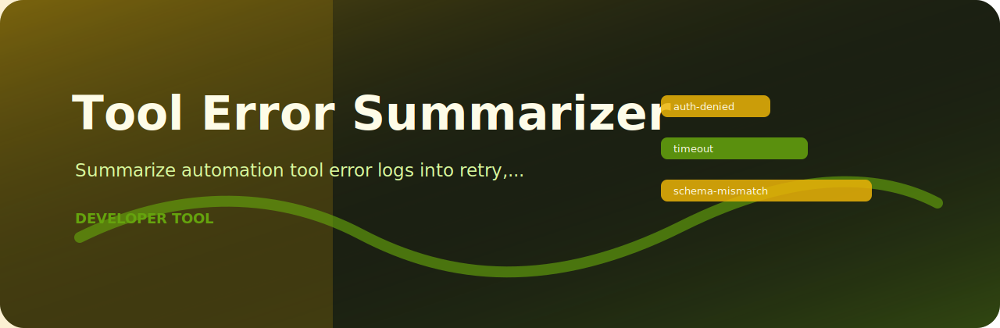

# Tool Error Summarizer

Summarize automation tool error logs into retry, auth, timeout, and schema findings. I keep it small because this kind of check is most useful when it can run beside the work, not after the work has already shipped.

## Project card



| Detail | Value |
| --- | --- |
| Area | developer tools |
| Command | `tool-error-summarizer` |
| Example | `examples/sample.txt` |

## What would make me stop a review

| Stopper | Level | Why it matters |
| --- | --- | --- |
| `auth-denied` | high | authorization failure detected |
| `timeout` | medium | timeout failure detected |
| `schema-mismatch` | low | schema validation failure detected |

## Run from a fresh clone

```bash
git clone https://github.com/mertefekurt/tool-error-summarizer.git
cd tool-error-summarizer
python -m venv .venv
source .venv/bin/activate
python -m pip install -e ".[dev]"
tool-error-summarizer examples/sample.txt
tool-error-summarizer examples/sample.txt --json
```
