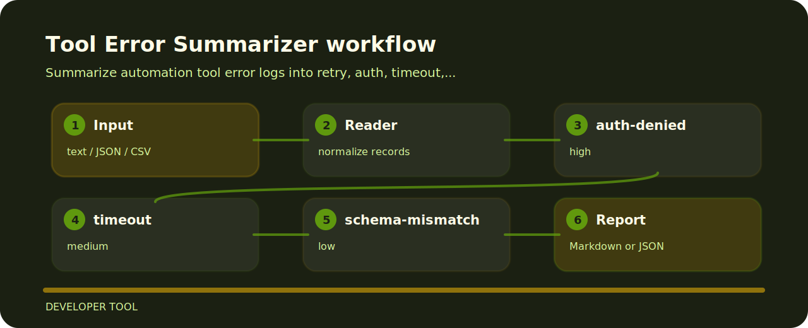

# Tool Error Summarizer

Tool Error Summarizer is meant for quick pull-request checks around tooling reviews. It favors explicit rules over a bulky dashboard.


## Rule ledger

- `auth-denied` - authorization failure detected (high); Check scopes, credentials, and tenant access..
- `timeout` - timeout failure detected (medium); Review retries, latency budget, and upstream health..
- `schema-mismatch` - schema validation failure detected (low); Update tool schema or argument generation..

## Finding map



## Command path

```bash
git clone https://github.com/mertefekurt/tool-error-summarizer.git
cd tool-error-summarizer
python -m pip install -e ".[dev]"
tool-error-summarizer examples/sample.txt
```

## Maintenance rhythm

```bash
ruff check .
pytest
python -m tool_error_summarizer --help
```
